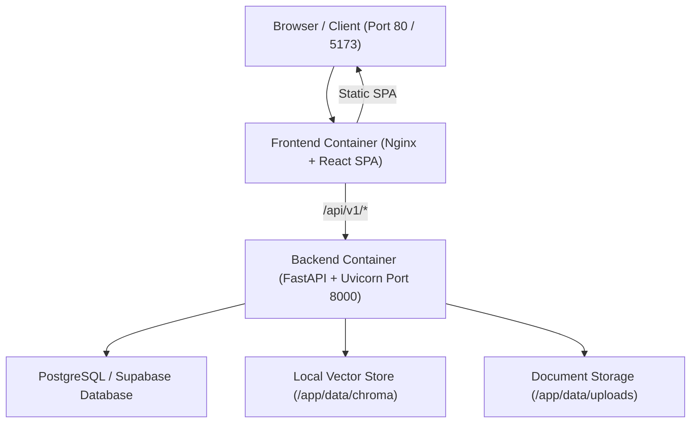

# Deployment & Production Operations Runbook

This guide covers deployment, containerization, operations, and maintenance for the **College RAG Assistant** platform.

---

## 1. Architecture Overview



---

## 2. Prerequisites

1. **Docker & Docker Compose**:
   - Docker Engine `v24.0+`
   - Docker Compose `v2.20+`
2. **PostgreSQL Database**:
   - Supabase PostgreSQL instance (or any standard PostgreSQL 15+ database).
3. **Environment File (`.env`)**:
   - Create `.env` in the root directory configured with your database and API keys.

---

## 3. Quick Start (Docker Compose)

### Single Command Launch
```bash
docker compose up --build -d
```

### Inspect Container Status
```bash
docker compose ps
```

### View Live Logs
```bash
# Follow all container logs
docker compose logs -f

# Follow backend logs only
docker compose logs -f backend

# Follow frontend logs only
docker compose logs -f frontend
```

### Stop Containers
```bash
docker compose down
```

---

## 4. Local Development (Without Docker)

You can also run both services locally using the provided launch scripts:

- **Launch Both**: Double-click `start-all.bat`
- **Launch Backend Only**: Double-click `start-backend.bat`
- **Launch Frontend Only**: Double-click `start-frontend.bat`

Or run manually in terminal:

```bash
# Terminal 1: Backend
conda activate college-rag-assistant
uvicorn app.main:app --app-dir backend --host 127.0.0.1 --port 8000 --reload

# Terminal 2: Frontend
cd frontend
npm run dev
```

---

## 5. Persistent Storage & Backups

The Docker configuration preserves all ingested data across restarts using host volume mounts:

| Host Path | Container Path | Description |
|---|---|---|
| `./data/uploads` | `/app/data/uploads` | Uploaded raw PDF documents |
| `./data/chroma` | `/app/data/chroma` | ChromaDB vector database index |

### Backup Procedures:
```bash
# Backup vector store and uploads
tar -czvf college_rag_data_backup_$(date +%Y%m%d).tar.gz ./data/
```

---

## 6. Health & Monitoring Endpoints

- **System Health**: `GET /health` (`http://localhost:8000/health`)
- **API Documentation**: `GET /docs` (`http://localhost:8000/docs`)
- **Admin Metrics**: `GET /api/v1/admin/metrics` (`require_role(ADMIN)`)
- **RAG Evaluation Suite**:
  ```bash
  conda run -n college-rag-assistant python backend/app/rag/evaluation/run_eval.py
  ```

---

## 7. Default Seeded Credentials

| Role | Email | Password | Access Level |
|---|---|---|---|
| **Admin** | `admin@college.edu` | `AdminPass123!` | Document Uploads, Chunk Inspector, Metrics |
| **Student** | `student@college.edu` | `StudentPass123!` | Knowledge Base Chat, Conversation History |
| **Test Student** | `alex_live_test@college.edu` | `password123` | Knowledge Base Chat |

